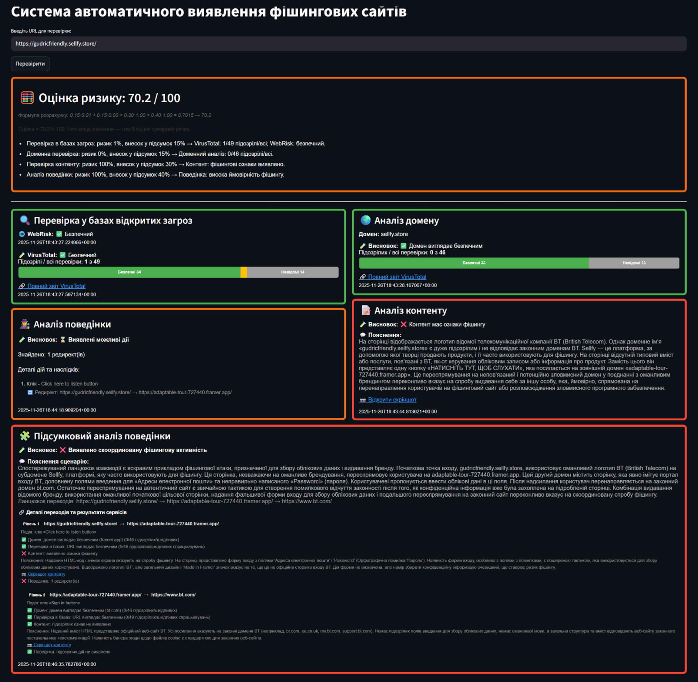
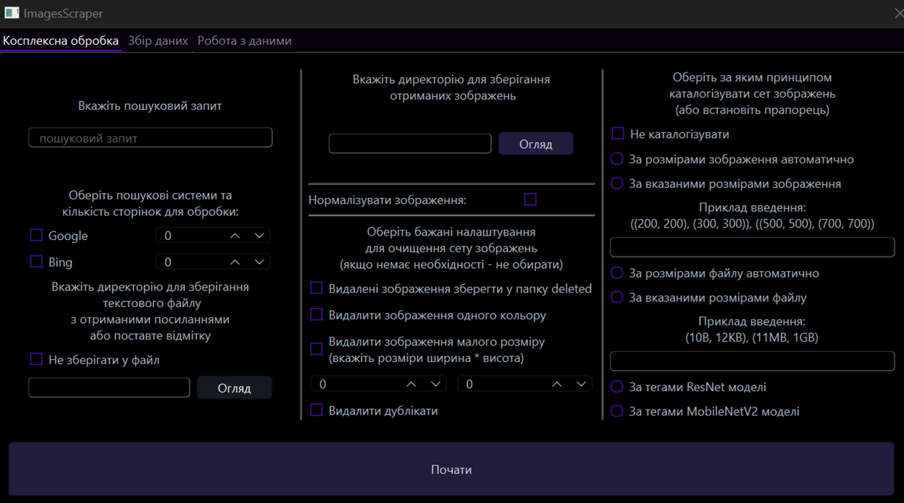
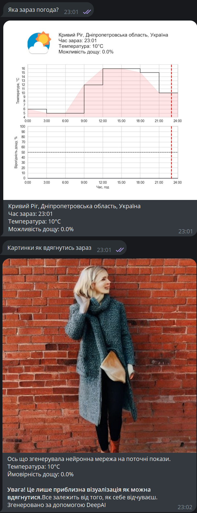

## 🛠️ Key Projects

### [🛡️ **Phishing Detection Microservice Platform**](https://github.com/lavrinenkoll/PhishingDetectionSystem)
AI-powered microservice system for multi-layer phishing detection and risk scoring. Combines LLM-based content analysis, domain inspection, behavior simulation, and threat intelligence into a unified risk score. Built with Python, Docker, PostgreSQL, and headless automation for scalable, modular deployment.

### [📦 **Image Processing and Cataloging System**](https://github.com/lavrinenkoll/ImageScraper)
A comprehensive system for scraping, normalizing, and cataloging images from online sources. This project features advanced image processing using machine learning models like ResNet50 and MobileNetV2, with a user-friendly interface for seamless data organization.

### [🌦️ **Weather AI Bot**](https://github.com/lavrinenkoll/WeatherAIBot)
An interactive bot for providing weather forecasts and outfit suggestions based on current conditions. Leveraging APIs like Firebase and cloud platforms, the bot includes real-time data visualization and user personalization features.

