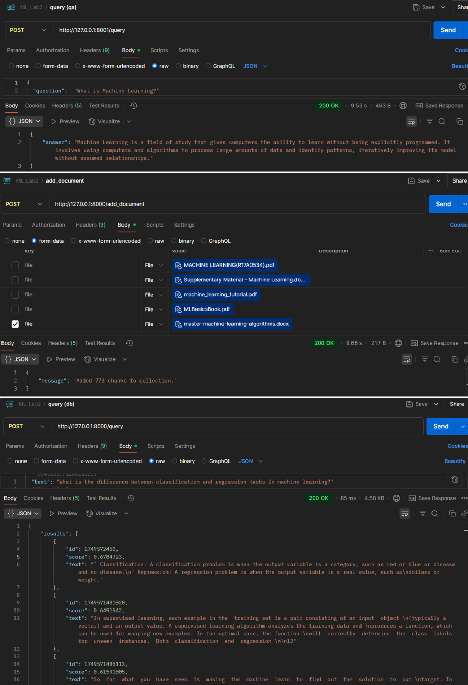

## 🧑‍💻 Mini Projects

### [📄 **Applied LLM Systems**](https://github.com/lavrinenkoll/AppliedLLMSystems)

Practical projects showcasing applied LLMs, semantic search, tool-calling agents, and multimodal RAG pipelines:
- Tool-calling agent – structured GPT-based agent
- Semantic search – local embeddings with vector retrieval
- Voice-RAG – transcription + RAG workflow

Focus: modular Python structure, embedding-based retrieval, RAG design, and clean separation of concerns.

### [🧠 **Vector-Based Contextual Q&A Assistant**](https://github.com/lavrinenkoll/SimpleRAG_Ollama)
A local retrieval-augmented generation (RAG) system that uses Qdrant as a vector store and Ollama to run LLMs locally. It enables contextual question answering by indexing documents (PDF, DOCX, HTML), retrieving relevant chunks, and generating answers with a lightweight local model.

